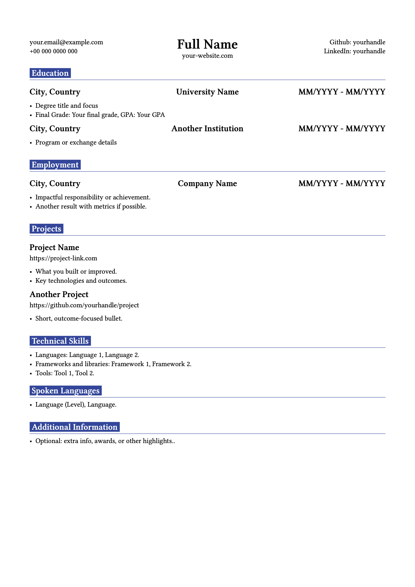

# Typst CV template

A CV template built with Typst. Edit the YAML config and compile to PDF. 



## Requirements

- Typst CLI installed (`typst`)

## Download

```bash
git clone https://github.com/hedysom/CV_swe.git
cd swe-cv
```

## Modify content

- Update `configuration.yaml` with your own data.

## Watch while editing

- For auto compilation on every save.

```bash
typst watch main.typ
```

## Compile

```bash
typst compile main.typ
```

This produces `main.pdf` in the project root.


## Project structure

- `main.typ` — Typst source
- `configuration.yaml` — Your CV data
- `main.pdf` — Output (generated)

## Note
Made from [this template](https://typst.app/universe/package/swe-cv), replacing the trailing comas at the end of lists, adding additional info section and small QOL adjustments.
